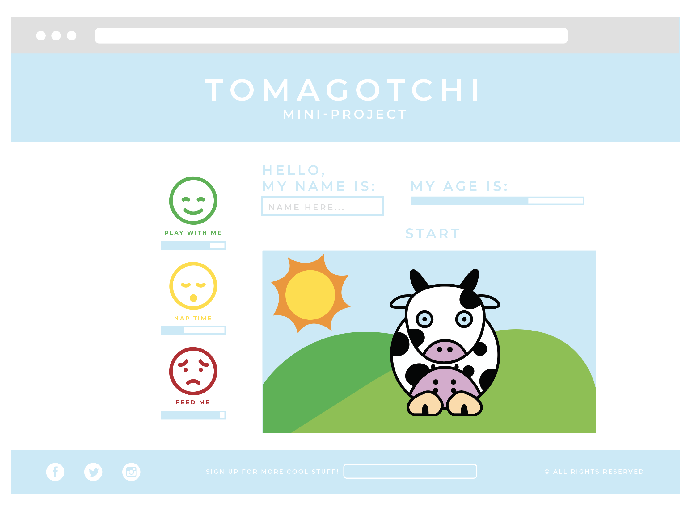
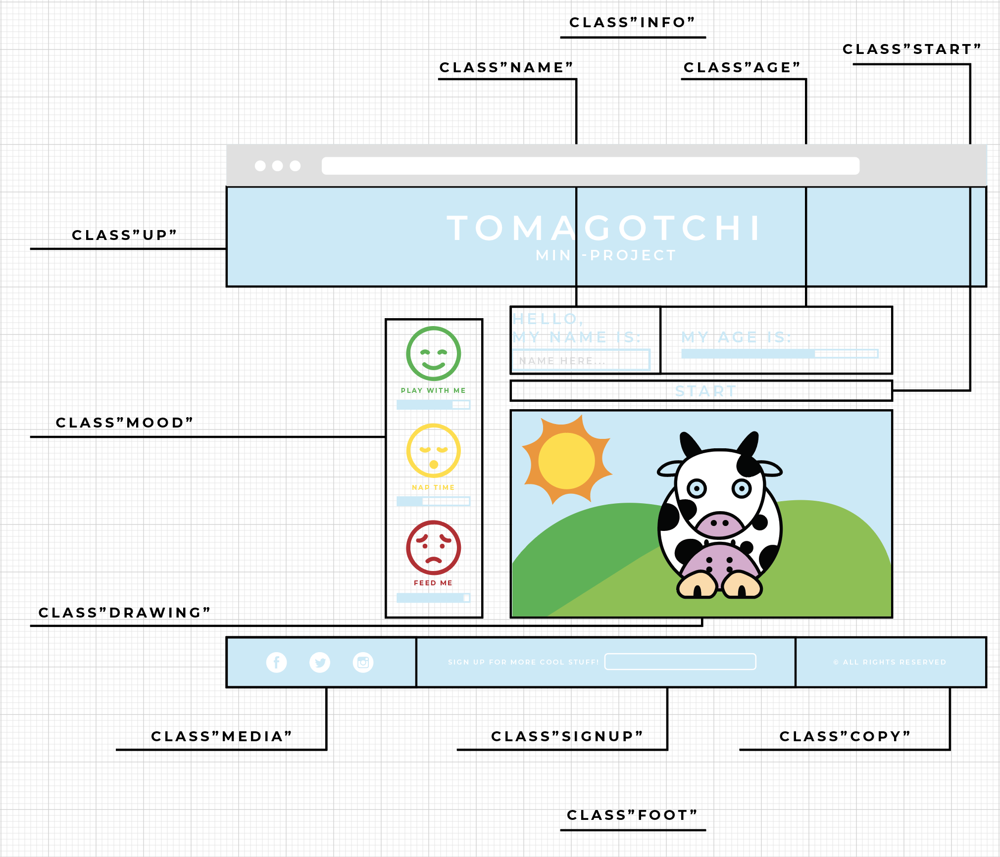

# Tamagotchi Project

### Description of the mini project:
##### Use the front-end web development skills to create a "living" pet! You'll have to use HTML, CSS, and JavaScript/jQuery to interact with the pet.

### Page layout

###### project in process, not finish yet.
